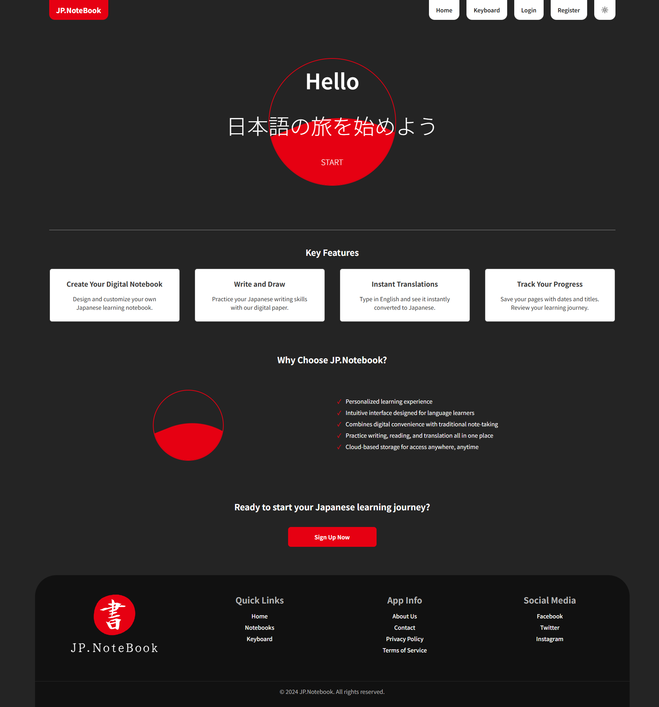
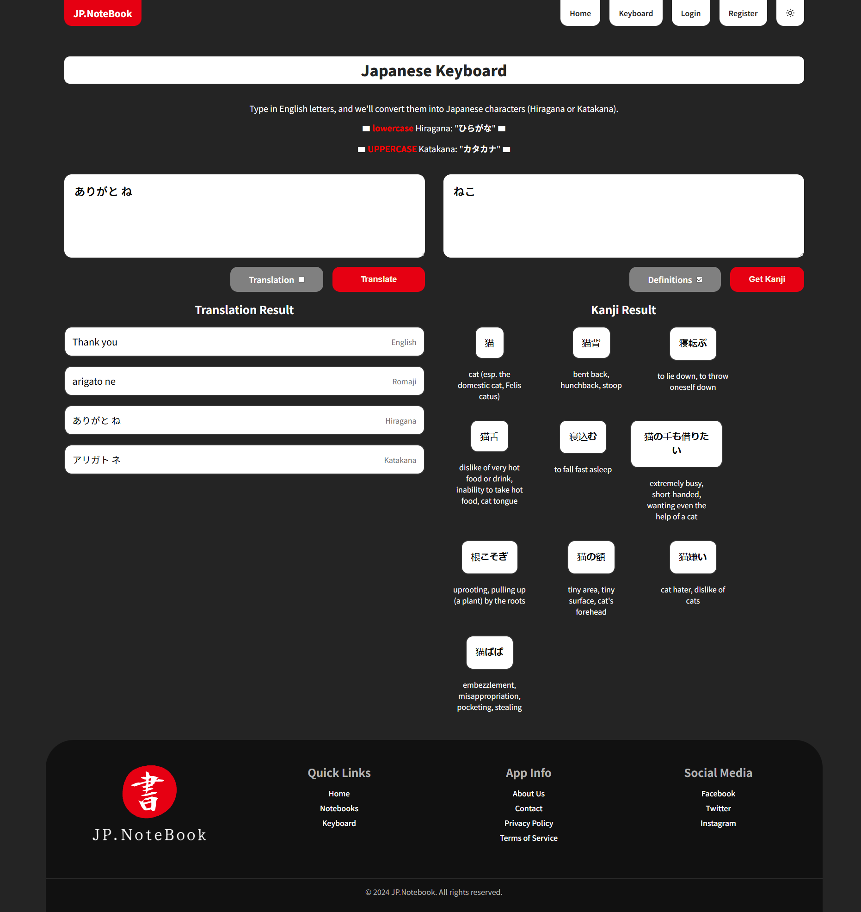
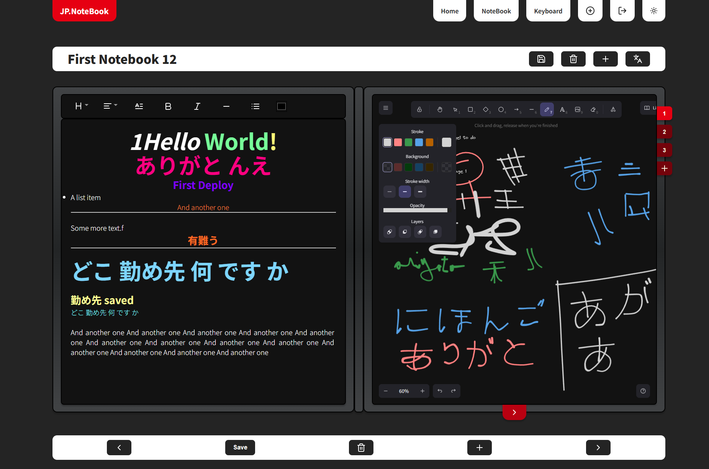

# Personal Japanese Learning Notebook

The **Personal Japanese Learning Notebook** is a web application designed for individuals studying the Japanese language. It allows users to create a personalized digital notebook where they can write, draw, and manage their learning materials. With features for audio pronunciation and notebook sharing (coming soon), this tool enhances the learning experience by providing a space for creativity and structured study.

## Table of Contents

- [Introduction](#introduction)
- [Architecture & Technologies](#architecture--technologies)
- [Development Report](#development-report)
- [App Overview](#app-overview)
- [API Endpoints](#api-endpoints)
- [Conclusion](#conclusion)
- [Acknowledgements](#acknowledgements)
- [Getting Started](#getting-started)

## Introduction

The **Personal Japanese Learning Notebook** is tailored for Japanese language learners and was developed solely by me. The application serves as a platform for users to create, organize, and enhance their learning materials.

## App Overview

- **Home Page**: Overview of the platform and featured products.

  

- **keyboard**: Write using Latin characters (romaji), and it will convert your text to Japanese.

  

- **notebook**: create a personalized digital notebook where they can write, draw, with easy access to trasnlation.

  

## Architecture & Technologies

The project utilizes the following technologies:

- **Frontend:** React.js
  - A dynamic and responsive user interface for a seamless user experience.
- **Backend:** Node.js with Express
  - A robust RESTful API that handles user requests and data management.
- **Database:** MongoDB
  - Flexible data storage for user information and notebook contents.
- **Text Editor:** ReactQuill
  - A rich text editor for creating and formatting notes.
- **Drawing Tool:** Excalidraw / Fabric.js
  - A canvas library for users to draw and sketch characters.
- **Audio Pronunciation:** (coming soon)
  - Integration with APIs for audio playback of selected text.
- **User Authentication:** JWT
  - Secure login and user session management.

## Development Report

### Successes

- **User-Centric Design:** Implemented an intuitive and responsive interface using React, allowing easy navigation through the app.
- **Backend Development:** Built a reliable RESTful API using Node.js and Express, ensuring efficient data handling.
- **Data Management:** Utilized MongoDB for flexible and scalable data storage solutions.
- **Text and Drawing Features:** Integrated ReactQuill for text input and Excalidraw for drawing, enabling users to create personalized notes.

### Challenges

- **Audio Integration:** The implementation of audio features is pending and will be addressed in future updates.
- **Data Synchronization:** Ensuring seamless data retrieval and updates between the frontend and backend posed some initial challenges.

### Lessons Learned

- **Self-Management:** Managing all aspects of the project independently has significantly improved my skills in full-stack development.

## App Overview

- **User Authentication:** Users can sign up and log in to access their personalized notebook.
- **Digital Notebook Features:**
  - Create and edit pages with text input in Japanese, English, and Arabic.
  - Draw or sketch on pages to practice writing.
  - Customize pages with different colors and styles.
- **Audio Pronunciation:** Users can select words to hear their pronunciations (implementation coming soon).
- **Notebook Sharing:** Users can share their notebooks with others via unique links (feature coming soon).

## API Endpoints

### Base URL:

- **API Root**: `http://localhost:5000/`
- **Swagger API Documentation**: `http://localhost:5000/api-docs/`

### User Management APIs:

- **Register a User (POST)**: `http://localhost:5000/api/users/register`
- **Login a User (POST)**: `http://localhost:5000/api/users/login`
- **Get All Users (GET)**: `http://localhost:5000/api/users/all`
- **Get a User by ID (GET)**: `http://localhost:5000/api/users/{id}`
- **Update a User by ID (PUT)**: `http://localhost:5000/api/users/update/{id}`
- **Delete a User by ID (DELETE)**: `http://localhost:5000/api/users/delete/{id}`

### Notebook Management APIs:

- **Create a Notebook (POST)**: `http://localhost:5000/api/notebooks/create`
- **Get a Notebook by ID (GET)**: `http://localhost:5000/api/notebooks/get/{id}`
- **Get All Notebooks (GET)**: `http://localhost:5000/api/notebooks/all`
- **Update a Notebook by ID (PUT)**: `http://localhost:5000/api/notebooks/update/{id}`
- **Delete a Notebook by ID (DELETE)**: `http://localhost:5000/api/notebooks/delete/{id}`
- **Get Notebooks for a User (GET)**: `http://localhost:5000/api/notebooks/user/{id}`

### Page Management APIs:

- **Create a Page (POST)**: `http://localhost:5000/api/pages/create`
- **Get a Page by ID (GET)**: `http://localhost:5000/api/pages/get/{id}`
- **Get All Pages (GET)**: `http://localhost:5000/api/pages/all`
- **Update a Page by ID (PUT)**: `http://localhost:5000/api/pages/update/{id}`
- **Delete a Page by ID (DELETE)**: `http://localhost:5000/api/pages/delete/{id}`
- **Get Pages by Notebook ID (GET)**: `http://localhost:5000/api/pages/notebook/{id}`

### Translation APIs:

- **Translate Text (POST)**: `http://localhost:5000/api/translate`
- **Convert Text to Kanji (POST)**: `http://localhost:5000/api/translate/kanji`

## Conclusion

The **Personal Japanese Learning Notebook** is an evolving project aimed at enhancing the learning journey for Japanese language students. As I continue to develop and refine the app, I look forward to adding features that will further enrich user experience.

## Acknowledgements

I would like to thank myself for the dedication and hard work throughout the development process. This project has provided valuable learning experiences and improved my skills in web development.

## Getting Started

### Prerequisites

- Ensure you have Node.js and npm installed on your machine.

### Installation

1. **Clone the Repository**

   ```bash
   git clone <repository_url>
   ```

2. **Install Dependencies**

   Navigate to both the backend and frontend directories and install the necessary packages:

   ```bash
   cd NoteBook-Back-end && npm install
   cd ../NoteBook-Front-end && npm install
   ```

### Hosting Servers

#### Start Back-end

```bash
cd NoteBook Back-end
npm start
```

- **Swagger API Documentation:** [http://localhost:5000/api-docs](http://localhost:5000/api-docs)

#### Start Front-end

```bash
cd NoteBook Front-end
npm run dev
```

- **Frontend:** [http://localhost:3000](http://localhost:3000)
